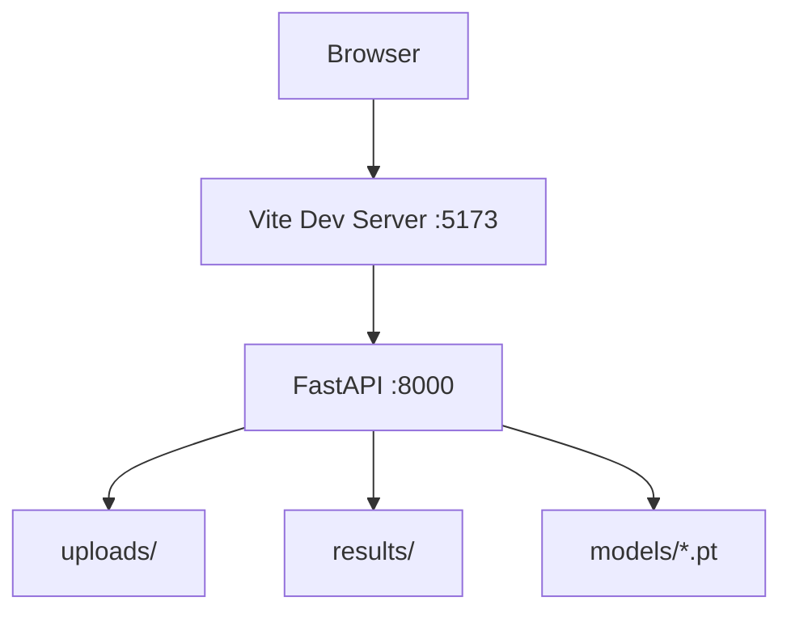
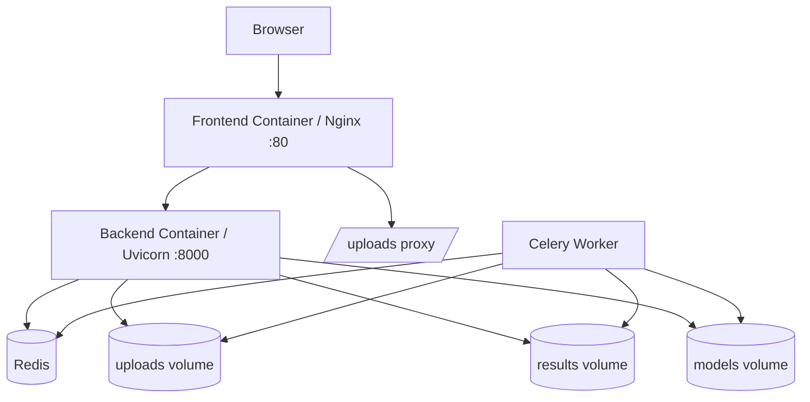
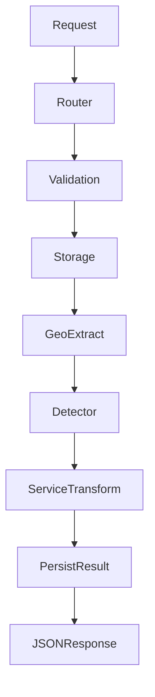
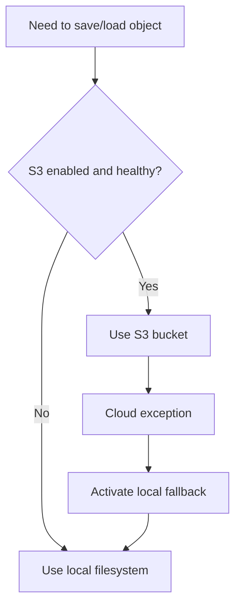
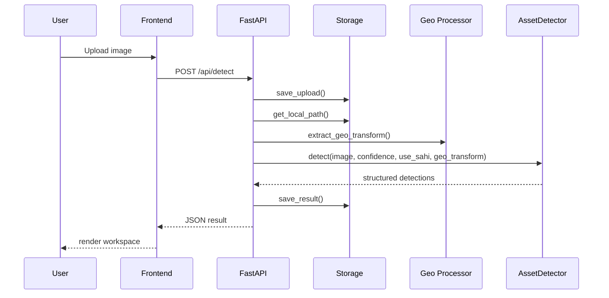
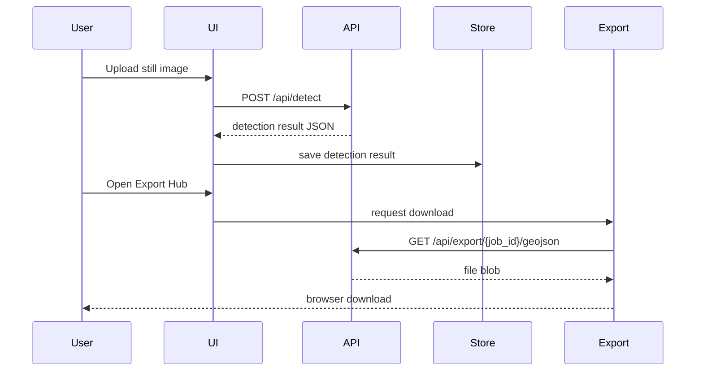
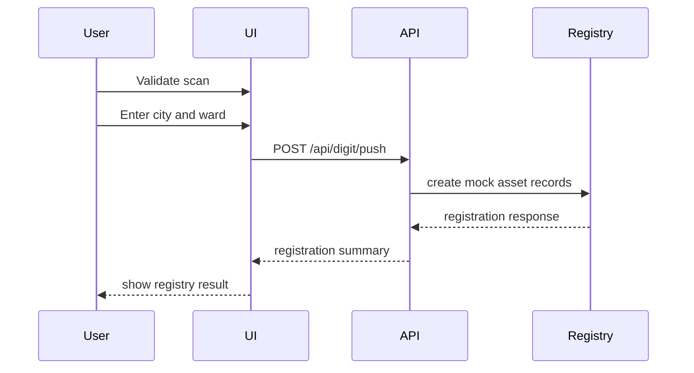
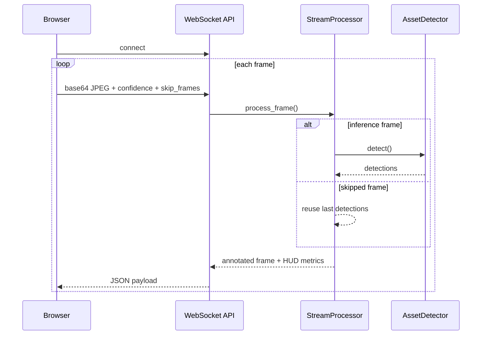

# Spatial Asset Management System

> A full-stack spatial intelligence platform for aerial, satellite, and drone imagery that combines computer vision, geospatial reasoning, reporting, export pipelines, live monitoring, temporal comparison, and civic-system handoff.

---

## 1. Document Purpose

This README is intentionally comprehensive.

It is designed to function as:

1. A product overview for stakeholders.
2. A technical architecture guide for engineers.
3. An onboarding handbook for new contributors.
4. An operational reference for local setup and deployment.
5. A workflow explainer for users exploring the end-to-end system.
6. A repository map for understanding where every major capability lives.

If you want the short version:

- The system ingests still imagery or video.
- It runs hybrid detection using multiple YOLO models and HSV segmentation.
- It can optionally extract geographic context from GeoTIFF metadata.
- It produces structured results for review, GIS export, reporting, and registry handoff.
- It also supports change detection between two scenes and live monitoring over WebSocket.

If you want the long version, this document covers the entire ecosystem in depth.

---

## 2. Table of Contents

- [1. Document Purpose](#1-document-purpose)
- [2. Table of Contents](#2-table-of-contents)
- [3. Executive Summary](#3-executive-summary)
- [4. Product Vision](#4-product-vision)
- [5. Problem Statement](#5-problem-statement)
- [6. What This Platform Does](#6-what-this-platform-does)
- [7. Primary User Personas](#7-primary-user-personas)
- [8. Core Capability Areas](#8-core-capability-areas)
- [9. Asset Taxonomy](#9-asset-taxonomy)
- [10. End-to-End User Journey](#10-end-to-end-user-journey)
- [11. High-Level System Architecture](#11-high-level-system-architecture)
- [12. Runtime Topology](#12-runtime-topology)
- [13. Repository Structure](#13-repository-structure)
- [14. Technology Stack](#14-technology-stack)
- [15. Architecture Principles](#15-architecture-principles)
- [16. Backend Architecture Overview](#16-backend-architecture-overview)
- [17. Frontend Architecture Overview](#17-frontend-architecture-overview)
- [18. ML and CV Detection Strategy](#18-ml-and-cv-detection-strategy)
- [19. Geospatial Processing Model](#19-geospatial-processing-model)
- [20. Storage Architecture](#20-storage-architecture)
- [21. API Surface Overview](#21-api-surface-overview)
- [22. Detection Workflow Deep Dive](#22-detection-workflow-deep-dive)
- [23. Change Detection Workflow Deep Dive](#23-change-detection-workflow-deep-dive)
- [24. Height Estimation Workflow Deep Dive](#24-height-estimation-workflow-deep-dive)
- [25. Live Stream Workflow Deep Dive](#25-live-stream-workflow-deep-dive)
- [26. Video Upload Workflow Deep Dive](#26-video-upload-workflow-deep-dive)
- [27. Export Workflow Deep Dive](#27-export-workflow-deep-dive)
- [28. Report Generation Workflow Deep Dive](#28-report-generation-workflow-deep-dive)
- [29. DIGIT Registry Workflow Deep Dive](#29-digit-registry-workflow-deep-dive)
- [30. Frontend Experience and Information Architecture](#30-frontend-experience-and-information-architecture)
- [31. State Management](#31-state-management)
- [32. Service Layer and Client API](#32-service-layer-and-client-api)
- [33. Data Models and Payload Shapes](#33-data-models-and-payload-shapes)
- [34. API Reference in Detail](#34-api-reference-in-detail)
- [35. Environment Variables](#35-environment-variables)
- [36. Local Development Setup](#36-local-development-setup)
- [37. Docker Deployment](#37-docker-deployment)
- [38. Celery and Background Processing Status](#38-celery-and-background-processing-status)
- [39. File-by-File Backend Map](#39-file-by-file-backend-map)
- [40. File-by-File Frontend Map](#40-file-by-file-frontend-map)
- [41. ML and Training Assets](#41-ml-and-training-assets)
- [42. Observability and Troubleshooting](#42-observability-and-troubleshooting)
- [43. Known Limitations](#43-known-limitations)
- [44. Security and Data Handling Notes](#44-security-and-data-handling-notes)
- [45. Performance Notes](#45-performance-notes)
- [46. Recommended Production Evolution](#46-recommended-production-evolution)
- [47. Roadmap Ideas](#47-roadmap-ideas)
- [48. FAQ](#48-faq)
- [49. Glossary](#49-glossary)
- [50. Appendix A: Sample Detection Response](#50-appendix-a-sample-detection-response)
- [51. Appendix B: Sequence Diagrams](#51-appendix-b-sequence-diagrams)
- [52. Appendix C: Contributor Onboarding Checklist](#52-appendix-c-contributor-onboarding-checklist)

---

## 3. Executive Summary

The Spatial Asset Management System is a domain-specific urban intelligence platform built around one simple idea:

**convert raw overhead imagery into structured, reviewable, exportable, and actionable urban asset intelligence.**

The repository currently contains:

- A FastAPI backend for ingestion, inference, export, change detection, height estimation, report generation, live stream processing, and DIGIT-style asset registry handoff.
- A React + Vite frontend that provides a modern dashboard shell, focused review pages, GIS exploration, operator controls, reporting, and live monitoring.
- ML and CV utilities that combine multiple YOLO models with HSV-based land-cover segmentation to cover a broad urban asset taxonomy.
- Dockerized deployment for full-stack local or containerized execution.
- Optional Redis + Celery infrastructure scaffolding for asynchronous workloads.
- Optional S3-backed storage with a graceful fallback to local filesystem storage.

This is not just an object detection demo.

It is closer to a compact spatial operations platform.

The codebase is structured to support the full journey:

1. Upload imagery.
2. Run hybrid inference.
3. Review detections visually.
4. Inspect spatial outputs on a map when CRS metadata is present.
5. Tune confidence and category filters.
6. Estimate building heights.
7. Export to GeoJSON, CSV, or Shapefile.
8. Generate a PDF audit report.
9. Push validated assets into a mock DIGIT registry.
10. Compare temporal imagery for change analysis.
11. Monitor live camera/video input for near-real-time awareness.

---

## 4. Product Vision

The long-term vision behind this platform is to act as a spatial decision-support system for urban governance, infrastructure inspection, planning, and operational review.

At a high level, the product aims to bridge several traditionally disconnected layers:

- Raw image acquisition.
- AI-powered detection and segmentation.
- Geospatial interpretation.
- Internal review and QA.
- Executive and stakeholder reporting.
- Machine-readable data delivery.
- Governance system handoff.

In many teams, these stages are spread across multiple tools:

- one tool for annotation or model inference,
- another tool for GIS review,
- another tool for reporting,
- another spreadsheet for delivery,
- and another civic or enterprise system for registry updates.

This project compresses that sprawl into one workflow-oriented environment.

### 4.1 Vision Statement

Create a practical spatial intelligence workbench where imagery becomes structured civic or operational knowledge without forcing users to glue together fragmented tools.

### 4.2 Product Philosophy

The system favors:

- end-to-end flow over isolated model demos,
- explainable review surfaces over black-box outputs,
- structured exports over visual-only dashboards,
- graceful degradation over hard failure when geospatial data is unavailable,
- extensibility over hard-coded single-purpose logic.

### 4.3 What “Spatial Asset Management” Means Here

In this repository, “spatial asset management” includes:

- building and property footprint interpretation,
- green cover and open-space observation,
- water and drainage recognition,
- road/footpath understanding,
- waste and vehicle surface detection,
- temporal change review,
- height estimation,
- delivery into governance-style records.

This scope makes the system relevant for:

- municipalities,
- utilities,
- infrastructure planning teams,
- GIS specialists,
- urban analytics groups,
- survey review teams,
- internal innovation or civic-tech units.

---

## 5. Problem Statement

Urban and infrastructure teams increasingly have access to imagery from:

- satellites,
- drones,
- orthomosaic surveys,
- webcams,
- mobile capture platforms,
- surveillance or inspection video.

But raw imagery alone is not operationally useful.

The hard part is transforming imagery into:

- asset counts,
- classified objects,
- spatial extents,
- map overlays,
- tabular records,
- review-ready outputs,
- decision-support summaries,
- and system-to-system handoff payloads.

Traditional pain points include:

- manual survey review takes too long,
- imagery is difficult to translate into structured asset inventories,
- non-georeferenced scenes still need useful analysis,
- teams need both human-readable and machine-readable outputs,
- different consumers require different output formats,
- data often stalls between analysis and governance operations,
- real-time awareness and historical comparison are usually split across different tools.

This platform addresses those gaps by combining AI inference with geospatial and operational workflows in one stack.

---

## 6. What This Platform Does

At a functional level, the platform supports the following major use cases.

### 6.1 Still Image Detection

Users can upload a still image and receive:

- detected assets,
- per-asset confidence,
- bounding boxes,
- optional segmentation polygons,
- optional geographic bounding boxes,
- optional area estimates in square meters,
- per-category summaries,
- a persistent job identifier,
- and a retrievable stored result.

### 6.2 Visual Review

Users can inspect detections on an overlay canvas with:

- ranked rendering,
- hover inspection,
- confidence-aware filtering,
- category visibility control,
- scene-level summary context.

### 6.3 GIS Review

When imagery includes CRS metadata and a geographic transform can be extracted, the system can:

- convert bounding boxes into approximate geographic polygons,
- render them on a Leaflet-based map,
- provide popup inspection,
- enable map-driven QA before export.

### 6.4 Control Surface

The frontend includes operator controls for:

- adjusting confidence threshold,
- toggling category visibility,
- reducing clutter,
- refining what downstream consumers will effectively see.

### 6.5 Height Estimation

The system can estimate building heights using:

- shadow analysis,
- building detections,
- basic GSD assumptions,
- fallback footprint heuristics when shadows are not recoverable.

### 6.6 Change Detection

Users can upload “before” and “after” imagery to:

- compute structural similarity,
- derive difference masks,
- identify likely changed regions,
- produce a heatmap,
- generate a summary narrative.

### 6.7 Live Monitoring

Users can stream JPEG frames over WebSocket for:

- near-real-time frame processing,
- live detection overlays,
- FPS and asset HUD metrics,
- compact category summaries.

### 6.8 Recorded Video Analysis

Users can upload a drone or surveillance video and receive:

- sampled frame analysis,
- an annotated MP4 output,
- per-category totals,
- high-level video metadata.

### 6.9 Export Delivery

Detection jobs can be exported as:

- GeoJSON,
- CSV,
- Shapefile ZIP.

### 6.10 Executive Reporting

Users can generate a PDF report that includes:

- report metadata,
- asset category summaries,
- total detections,
- optional height information if provided to the generator,
- certification/disclaimer language.

### 6.11 Governance Handoff

Validated detections can be pushed into a mock DIGIT-style registry that simulates:

- asset registration,
- category mapping,
- tenant/city scoping,
- downstream governance integration.

---

## 7. Primary User Personas

### 7.1 GIS Analyst

The GIS analyst cares about:

- geographic validity,
- exportability,
- polygon/map inspection,
- structured geometry handoff.

What they use most:

- GIS Explorer,
- GeoJSON export,
- Shapefile export,
- summary metadata.

### 7.2 Urban Operations Reviewer

The operations reviewer cares about:

- quick scene understanding,
- clean overlays,
- manageable confidence controls,
- PDF outputs,
- change triage.

What they use most:

- Command Deck,
- Review Canvas,
- Scene Controls,
- Report Studio,
- Change Watch.

### 7.3 Civic-System or Registry Operator

The governance or registry operator cares about:

- validated counts,
- clear metadata,
- consistent job reference,
- downstream registration,
- traceability.

What they use most:

- DIGIT Handoff,
- report generation,
- job-specific exports,
- category summaries.

### 7.4 Infrastructure Monitoring Team

The monitoring team cares about:

- live feedback,
- recorded video review,
- quick count summaries,
- operator-friendly interfaces.

What they use most:

- Live Monitor,
- real-time WebSocket pipeline,
- uploaded video processing,
- HUD metrics.

### 7.5 ML / Platform Engineer

The engineering team cares about:

- how models are loaded,
- how routes invoke services,
- where storage decisions happen,
- what is synchronous versus asynchronous,
- where to extend the platform.

What they use most:

- `backend/app/models/detector.py`,
- `backend/app/routers/detection.py`,
- `backend/app/services/*`,
- `frontend/src/services/api.js`,
- `frontend/src/store/detectionStore.js`.

---

## 8. Core Capability Areas

The repository can be understood as seven capability pillars.

| Capability Pillar | Description | Key Files |
|---|---|---|
| Ingestion | Accepts image and video uploads, validates content, persists data | `backend/app/routers/detection.py`, `backend/app/services/storage.py` |
| Hybrid Detection | Runs multiple YOLO models plus HSV segmentation | `backend/app/models/detector.py`, `backend/app/models/color_segmenter.py` |
| Geospatial Enrichment | Extracts GeoTIFF metadata and derives approximate geo extents | `backend/app/services/geo_processor.py`, `backend/app/utils/geo_utils.py` |
| Review and UX | Presents results in a dashboard with dedicated workspaces | `frontend/src/App.jsx`, `frontend/src/components/*` |
| Delivery | Exports results as GIS/tabular artifacts and PDF reports | `backend/app/routers/export.py`, `backend/app/services/export_service.py`, `backend/app/services/report_generator.py` |
| Monitoring and Temporal Analysis | Supports live stream, uploaded video, and before/after change detection | `backend/app/services/stream_processor.py`, `backend/app/services/change_detection.py` |
| Governance Handoff | Pushes validated detections into a mock DIGIT registry | `backend/app/services/digit_integration.py` |

---

## 9. Asset Taxonomy

The system is designed around eight primary categories.

| Category | Detection Path | Notes |
|---|---|---|
| Properties & Buildings | YOLO model | Primary built-structure class |
| Trees & Green Cover | YOLO and/or HSV | HSV is especially important for aerial imagery |
| Parks & Open Spaces | HSV and optional landcover model | Large bright-green areas |
| Water Bodies | HSV and optional landcover model | Blue/teal land-cover segmentation |
| Roads & Footpaths | YOLO, landcover, and HSV | Can become broad in pixel-only fallback cases |
| Drains & Sewage | HSV | Dark linear/area channel detection |
| Vehicles & Parking | YOLO model | Uses mapped COCO-style vehicle classes |
| Waste Dumps | YOLO and HSV | Mixed-color irregular patches and model detections |

### 9.1 Important Reality Check

The repository references a hybrid model strategy, but actual coverage depends on which model files are present in `backend/models`.

The detector looks for:

- `best.pt` for buildings,
- `trees.pt`,
- `roads.pt`,
- `waste.pt`,
- `vehicles.pt`,
- `landcover.pt`.

If some of these files are missing, the system still runs.

That is because the detector degrades gracefully:

- available models are used,
- missing model types are skipped,
- HSV analysis still covers several land-cover categories.

### 9.2 Why a Hybrid Strategy Exists

This codebase is opinionated about aerial imagery.

The implementation explicitly acknowledges that:

- generic or ground-trained models do not always transfer cleanly to overhead imagery,
- certain surface classes are easier to identify by color-space heuristics than by generic detection models,
- different asset types need different inference strategies.

That is why the repository combines:

- instance/box detection,
- segmentation masks where available,
- tiled inference via SAHI,
- and rule-based HSV land-cover segmentation.

---

## 10. End-to-End User Journey

The easiest way to understand the ecosystem is to follow a typical end-to-end scenario.

### 10.1 Scenario: Spatial Asset Review from a GeoTIFF

1. A user uploads a GeoTIFF or high-resolution aerial still.
2. The backend stores the upload locally or in S3.
3. The backend attempts to extract a geographic transform.
4. The detector runs hybrid inference.
5. Structured detections are saved as a persisted job result.
6. The frontend receives the result immediately.
7. The user lands in the detection workspace command deck.
8. The user opens the Review Canvas to visually confirm the scene.
9. The user adjusts confidence and category visibility in Scene Controls.
10. The user opens GIS Explorer to validate spatial placement.
11. The user estimates building heights if relevant.
12. The user exports GeoJSON or Shapefile for GIS consumers.
13. The user generates a PDF for stakeholders.
14. The user pushes approved records into the mock DIGIT registry.

### 10.2 Scenario: Change Triage

1. A user uploads “before” and “after” images of the same area.
2. The backend resizes both to a standard comparison space.
3. Pixel difference and SSIM are combined.
4. Significant contours are extracted as change regions.
5. A heatmap and summary are generated.
6. The frontend shows region counts, severity, and a change narrative.

### 10.3 Scenario: Live Awareness

1. A user opens the Live Monitor workspace.
2. The browser captures camera frames.
3. Frames are converted to base64 JPEG and sent via WebSocket.
4. The backend processes every Nth frame based on `skip_frames`.
5. The backend returns an annotated frame, category counts, FPS, and detection totals.
6. The frontend displays the live HUD and recent inference state.

### 10.4 Scenario: Recorded Drone Footage

1. A user uploads an MP4, AVI, MOV, or MKV.
2. The backend stores the video.
3. Frames are sampled across the clip.
4. The detector runs still-image inference on sampled frames.
5. The last known detections are drawn across output frames.
6. An annotated MP4 is produced and made downloadable.

---

## 11. High-Level System Architecture

```mermaid
flowchart LR
    User[User / Analyst / Operator]
    UI[React Dashboard]
    API[FastAPI Backend]
    DET[Hybrid Detector]
    GEO[Geo Processor]
    EXP[Export + Report Services]
    LIVE[Stream Processor]
    DIGIT[Mock DIGIT Registry]
    STORE[Storage Service]
    FS[Local Filesystem]
    S3[S3 Bucket]
    REDIS[Redis]
    CELERY[Celery Worker]

    User --> UI
    UI --> API
    API --> DET
    API --> GEO
    API --> EXP
    API --> LIVE
    API --> DIGIT
    API --> STORE
    STORE --> FS
    STORE --> S3
    API -. optional async scaffolding .-> REDIS
    REDIS -. broker/backend .-> CELERY
    CELERY -. model tasks .-> DET
```



### 11.1 Architecture Summary

The architecture is split into three main layers:

- presentation layer,
- orchestration and service layer,
- inference and data transformation layer.

The presentation layer is the React frontend.

The orchestration layer is the FastAPI backend, which:

- validates inputs,
- persists uploads,
- invokes services,
- shapes responses,
- serves static uploads,
- exposes REST and WebSocket interfaces.

The inference and transformation layer includes:

- the detector,
- color segmentation,
- geospatial transform extraction,
- export generators,
- report generation,
- change analysis,
- live stream drawing logic.

---

## 12. Runtime Topology

The repository supports both direct development mode and containerized mode.

### 12.1 Local Dev Topology



### 12.2 Docker Topology



### 12.3 Important Operational Note

Even though Redis and Celery are part of the Docker topology, the primary detection route currently executes inference synchronously in the API request path because the frontend expects an immediate response.

This is a crucial nuance:

- Celery is scaffolded.
- Worker code exists.
- Redis is configured.
- But the main image detection route still performs inline inference.

That means the runtime behavior today is:

- async-ready architecture,
- mostly sync user-facing detection execution.

---

## 13. Repository Structure

```text
spatial-asset-mgmt/
├── README.md
├── docker-compose.yml
├── .env.example
├── backend/
│   ├── Dockerfile
│   ├── requirements.txt
│   ├── output.json
│   ├── test_detect.py
│   ├── test_detect2.py
│   ├── test_detect3.py
│   ├── test_s3_integration.py
│   ├── test_satellite.jpg
│   ├── test_image.jpg
│   └── app/
│       ├── main.py
│       ├── config.py
│       ├── celery_app.py
│       ├── tasks.py
│       ├── models/
│       ├── routers/
│       ├── schemas/
│       ├── services/
│       └── utils/
├── frontend/
│   ├── Dockerfile
│   ├── package.json
│   ├── vite.config.js
│   ├── tailwind.config.js
│   ├── index.html
│   ├── public/
│   └── src/
│       ├── App.jsx
│       ├── main.jsx
│       ├── index.css
│       ├── components/
│       ├── services/
│       ├── store/
│       └── utils/
└── ml/
    ├── train.py
    ├── data.yaml
    └── Colab_Training_LandCover.ipynb
```

### 13.1 Layered Reading Order

If you are new to the repo, read it in this order:

1. `backend/app/main.py`
2. `backend/app/routers/detection.py`
3. `backend/app/models/detector.py`
4. `backend/app/services/*`
5. `frontend/src/App.jsx`
6. `frontend/src/store/detectionStore.js`
7. `frontend/src/services/api.js`
8. `frontend/src/components/*`

That order mirrors how the actual runtime flows.

---

## 14. Technology Stack

### 14.1 Backend Stack

| Layer | Technology | Role |
|---|---|---|
| API framework | FastAPI | REST and WebSocket API surface |
| ASGI server | Uvicorn | API runtime |
| Validation/config | Pydantic Settings | Typed settings and env handling |
| Async file IO | aiofiles | Non-blocking file writes/reads |
| Task queue | Celery | Background task scaffolding |
| Broker/result backend | Redis | Celery transport/backend |
| Cloud storage SDK | boto3 | Optional S3 storage |
| Reporting | ReportLab | PDF generation |

### 14.2 ML / CV Stack

| Layer | Technology | Role |
|---|---|---|
| Core model runner | Ultralytics YOLO | Object detection / segmentation |
| Tiled inference | SAHI | Slice-aided large image inference |
| Image processing | Pillow | PIL image manipulation |
| Numeric computation | NumPy | Array operations |
| Computer vision | OpenCV | Frame/video/image CV utilities |
| Structural comparison | scikit-image | SSIM for change detection |

### 14.3 Geospatial Stack

| Layer | Technology | Role |
|---|---|---|
| Raster metadata | Rasterio | GeoTIFF CRS and bounds extraction |
| Geospatial data tooling | GeoPandas | Available dependency for future workflows |
| Geometry ops | Shapely | Available dependency for future geometry logic |
| Projection utilities | pyproj | Available dependency for CRS handling |
| Vector I/O | Fiona | Geospatial stack support |
| Shapefile generation | pyshp | Zipped Shapefile export |

### 14.4 Frontend Stack

| Layer | Technology | Role |
|---|---|---|
| UI runtime | React 18 | Component architecture |
| Build tool | Vite | Fast local dev and production bundling |
| Styling | Tailwind CSS | Utility-first styling |
| Icons | lucide-react | UI iconography |
| State management | Zustand | Lightweight global app state |
| HTTP client | Axios | API calls |
| Map rendering | Leaflet + React Leaflet | GIS explorer |
| Canvas overlays | Konva + React Konva | Detection overlay rendering |
| File ingestion | react-dropzone | Drag-and-drop upload flows |

### 14.5 Infrastructure Stack

| Layer | Technology | Role |
|---|---|---|
| Containers | Docker | Packaging and deployment |
| Multi-service orchestration | Docker Compose | Local stack composition |
| Static frontend serving | Nginx | SPA hosting and proxying |

---

## 15. Architecture Principles

The codebase reflects a few consistent engineering choices.

### 15.1 Graceful Degradation

Examples:

- If GeoTIFF metadata is unavailable, detection still works in pixel mode.
- If S3 fails, storage falls back to local files.
- If optional YOLO models are missing, remaining models and HSV logic still operate.
- If report height hydration is unavailable, report generation continues.

### 15.2 Workflow Orientation

The frontend is not built as a generic “show everything in one screen” admin panel.

It is increasingly organized around:

- focused workspaces,
- role-appropriate review surfaces,
- downstream workflow transitions.

### 15.3 Operational Practicality

The system favors outputs people can actually use:

- map overlays,
- CSVs,
- Shapefiles,
- GeoJSON,
- downloadable PDFs,
- registry-like JSON records,
- annotated MP4 videos.

### 15.4 Extensibility

The code leaves several hooks for future evolution:

- Celery workers,
- richer S3 usage,
- new model files,
- better geometry handling,
- stronger registry integration,
- improved reporting,
- persistent databases.

---

## 16. Backend Architecture Overview

The backend is centered around FastAPI but split into clear responsibilities:

- routing,
- model lifecycle,
- services,
- schemas,
- utilities,
- optional task workers.

### 16.1 Core Backend Flow



### 16.2 Backend Responsibility Map

| Module Area | Responsibility |
|---|---|
| `app/main.py` | App creation, lifespan model loading, router registration, static upload mount |
| `app/config.py` | Environment-backed settings |
| `app/routers/` | Public API and WebSocket contract |
| `app/models/` | Detection and segmentation logic |
| `app/services/` | Domain workflows and output generation |
| `app/schemas/` | Response model definitions |
| `app/utils/` | Shared utility helpers |
| `app/tasks.py` | Celery task implementations |
| `app/celery_app.py` | Celery bootstrap |

### 16.3 FastAPI Lifespan Design

At startup:

- the app creates a global `AssetDetector`,
- stores it under `app.state.detector`,
- prints a startup message.

At shutdown:

- the detector reference is deleted,
- a shutdown message is printed.

This keeps model loading out of hot request paths for the common case.

### 16.4 Static Upload Serving

The backend mounts:

- `/uploads`

This means uploaded files stored locally can be served directly by FastAPI when not using S3.

---

## 17. Frontend Architecture Overview

The frontend is a React dashboard application organized around workflow surfaces rather than purely technical views.

### 17.1 Top-Level Modes

The app presents three primary operating modes:

- detection workspace,
- change detection workspace,
- live monitoring workspace.

### 17.2 Detection Workspace Pages

Within the detection mode, the user navigates across:

- Command Deck,
- Review Canvas,
- GIS Explorer,
- Scene Controls,
- Height Lab,
- Export Hub,
- Report Studio,
- DIGIT Handoff.

### 17.3 Frontend Architectural Intent

The UI is designed so that:

- the shell provides context,
- the active page provides focus,
- secondary tasks do not overwhelm the primary review surface,
- operators can branch to the right downstream tool at the right time.

### 17.4 Frontend Flow Summary


---

## 18. ML and CV Detection Strategy

The heart of the system is `backend/app/models/detector.py`.

That module does not behave like a single-model detector.

It behaves like a hybrid orchestration layer across multiple specialized detectors and land-cover heuristics.

### 18.1 Why the Detector Is Hybrid

Urban overhead imagery is messy.

No single off-the-shelf model cleanly handles:

- rooftops,
- vehicles,
- trees,
- road surfaces,
- waste patterns,
- water,
- parks,
- drainage zones,
- and the visual ambiguity introduced by shadows and compression.

The repository addresses this by combining:

- category-specific YOLO models when available,
- land-cover segmentation when available,
- HSV color analysis for surface-dominant classes,
- SAHI tiled inference for large imagery.

### 18.2 Detector Responsibilities

The detector class is responsible for:

- loading available model files,
- mapping raw model class IDs into domain categories,
- running inference with or without SAHI,
- transforming detections into a unified schema,
- enriching detections with optional geo extents and area,
- merging results into a structured summary payload.

### 18.3 Detector Input Contract

The detector accepts:

- a PIL image,
- a confidence threshold,
- a `use_sahi` flag,
- an optional `geo_transform`.

### 18.4 Detector Output Contract

The detector returns:

- `total_detections`,
- `detections`,
- `summary`,
- `image_size`.

Each detection includes:

- `category`,
- `confidence`,
- `bbox_pixels`,
- `bbox_geo` when available,
- `area_sqm` when derivable,
- `pixel_area`,
- `color`,
- `mask_polygon` when available.

### 18.5 Model Families Referenced by Code

The detector looks for the following model file families:

| Internal Key | Expected File | Purpose |
|---|---|---|
| `buildings` | `best.pt` | Properties & Buildings |
| `trees` | `trees.pt` | Trees & Green Cover |
| `roads` | `roads.pt` | Roads & Footpaths |
| `waste` | `waste.pt` | Waste Dumps |
| `vehicles` | `vehicles.pt` | Vehicles & Parking |
| `landcover` | `landcover.pt` | Trees, Parks, Water, Roads |

### 18.6 Category Maps

The model output is normalized into domain-friendly asset names.

This matters because raw model class indices are not meaningful to downstream users.

The code performs category mapping so everything downstream sees a stable taxonomy.

### 18.7 When SAHI Is Used

SAHI is used when:

- `use_sahi` is enabled,
- and an SAHI model wrapper was successfully created for the model.

SAHI helps on large imagery by:

- slicing the image into windows,
- running predictions per window,
- merging overlapping results.

### 18.8 When Direct YOLO Is Used

Direct YOLO inference is used when:

- SAHI is disabled,
- or SAHI initialization failed,
- or the path is chosen for speed-sensitive workloads such as live processing.

### 18.9 Color Segmentation Role

HSV segmentation is not just a fallback of last resort.

In this codebase it is a deliberate detection path for categories where surface appearance is informative at aerial scale.

The categories actively pushed through HSV analysis are:

- Parks & Open Spaces,
- Water Bodies,
- Drains & Sewage,
- Trees & Green Cover,
- Roads & Footpaths.

### 18.10 Response Construction Logic

The detector aggregates all detections into a response summary by:

- grouping by category,
- counting detections,
- accumulating area in square meters when available,
- averaging confidence.

This provides both per-instance data and overview-level scene composition.

### 18.11 Practical Implications

From a product perspective, this means:

- the system is resilient when some models are absent,
- land-cover classes remain detectable in pixel-only mode,
- export and reporting are decoupled from any single model architecture,
- the frontend only needs to consume one normalized output format.

---

## 19. Geospatial Processing Model

The geospatial story in this repository is pragmatic rather than fully GIS-heavy.

### 19.1 What the System Tries to Do

When an uploaded image is georeferenced, the backend attempts to:

- extract a geographic transform,
- convert detection extents from pixels to lon/lat bounding boxes,
- estimate area in square meters,
- expose map-ready geometries downstream.

### 19.2 Where Geo Extraction Happens

Geo extraction is handled in:

- `backend/app/services/geo_processor.py`

That service:

- opens the image via Rasterio,
- checks whether a CRS exists,
- reads bounds,
- converts bounds into a simplified transform tuple:
  - origin longitude,
  - origin latitude,
  - width in degrees,
  - height in degrees.

### 19.3 Important Simplification

The current system uses a simplified geographic model.

It does **not** currently:

- preserve full affine transforms,
- handle arbitrary rotation/skew,
- maintain exact projection fidelity through all outputs.

Instead, it uses a bounding-extent-based approximation sufficient for:

- map visualization,
- rough area estimation,
- polygon previews,
- lightweight export workflows.

### 19.4 Pixel-to-Geo Conversion

Pixel-to-geo conversion logic appears in:

- `backend/app/models/detector.py`
- `backend/app/models/color_segmenter.py`
- `backend/app/utils/geo_utils.py`

The shared idea is:

- normalize the pixel position within the image extent,
- interpolate within geographic bounds,
- derive lon/lat corners.

### 19.5 Area Estimation

Area estimation uses:

- degree width,
- degree height,
- an equirectangular approximation,
- and cosine correction at the origin latitude.

This is appropriate for:

- rough area estimates,
- lightweight reporting,
- comparative review.

It is **not** equivalent to rigorous cadastral or engineering-grade measurement.

### 19.6 How the Frontend Uses Geo Data

When geo data is available:

- the frontend enters GIS-ready mode,
- detections can be rendered as polygons in Leaflet,
- export outputs become more meaningful for GIS consumers,
- the user sees the system as map-aware rather than pixel-only.

When geo data is absent:

- detection still works,
- overlay review still works,
- reporting still works,
- exports still work,
- the map becomes a standby experience rather than breaking.

---

## 20. Storage Architecture

Storage is abstracted through `backend/app/services/storage.py`.

This is an important design decision because it decouples:

- route logic,
- persistence implementation,
- and cloud/local runtime differences.

### 20.1 Supported Storage Modes

The code supports two operational storage modes:

1. local filesystem storage,
2. S3-backed storage.

### 20.2 Local Storage Mode

In local mode:

- uploads are written to `UPLOAD_DIR`,
- results are written to `RESULTS_DIR`,
- URLs are served from `/uploads/...`,
- the backend mounts those files statically.

### 20.3 S3 Storage Mode

In S3 mode:

- uploads are written to `uploads/<filename>` in the bucket,
- results are written to `results/<filename>` in the bucket,
- public-style URLs are generated using bucket and region metadata,
- temporary files are downloaded when local file access is required.

### 20.4 Fallback Behavior

One of the stronger engineering details in the repo is that S3 mode is not all-or-nothing.

If S3 errors occur, the storage service can:

- activate a local fallback,
- continue execution,
- avoid hard platform failure.

This is valuable in development and resilience scenarios.

### 20.5 Storage Service Responsibilities

The storage service handles:

- ensuring local directories exist,
- saving uploads,
- saving JSON results,
- loading persisted results,
- resolving browser-facing asset URLs,
- downloading temp files when cloud objects need local handling,
- cleaning up temporary files.

### 20.6 Storage Decision Flow



### 20.7 Storage Artifacts by Feature

| Artifact | Typical Location | Produced By |
|---|---|---|
| Uploaded still image | `uploads/<job>_<filename>` | `/api/detect` |
| Detection result JSON | `results/<job>.json` | detector route |
| Change images | `uploads/<job>_before.jpg`, `uploads/<job>_after.jpg` | change route |
| Uploaded video | `uploads/<job>_<filename>` | video route |
| Annotated video | `uploads/<job>_annotated.mp4` | video processing |
| Video result JSON | `results/<job>_video.json` | video route / task |

---

## 21. API Surface Overview

The backend exposes:

- REST endpoints,
- a WebSocket endpoint,
- a static upload mount.

### 21.1 REST Resource Groups

| Group | Purpose |
|---|---|
| Health | liveness checks |
| Detection | image inference and result retrieval |
| Change analysis | before/after comparison |
| Height estimation | building height approximation |
| DIGIT | registry simulation |
| Report | PDF generation |
| Export | GeoJSON / CSV / Shapefile delivery |
| Video | uploaded video processing and download |

### 21.2 WebSocket Group

| Group | Purpose |
|---|---|
| Stream | live frame ingestion and annotated response |

### 21.3 API Style

The API favors:

- task-specific routes,
- form-data uploads for media endpoints,
- JSON responses,
- direct artifact downloads for exports and reports.

---

## 22. Detection Workflow Deep Dive

This is the core flow for still-image intelligence.

### 22.1 Request Entry

The route is:

- `POST /api/detect`

It accepts:

- `file`,
- `confidence`,
- `use_sahi`.

### 22.2 Validation

The route:

- checks content type starts with `image/`,
- reads upload bytes,
- rejects empty files,
- enforces `MAX_IMAGE_SIZE_MB`.

### 22.3 Job Identity

A unique `job_id` is generated with UUID.

The uploaded file is renamed to:

- `<job_id>_<safe_original_name>`

### 22.4 Upload Persistence

The upload is saved through the storage service.

This means the route itself is storage-agnostic.

### 22.5 Geo Extraction

The route fetches a local path for the uploaded file and attempts to extract a geo transform.

That transform is optional.

If the file is not georeferenced, the flow continues normally in pixel mode.

### 22.6 Synchronous Detection Execution

Although Celery exists in the repo, the route uses `_run_detection_sync`.

This function:

- loads the image into PIL,
- retrieves the detector from `app.state`,
- runs detection in a thread pool,
- attaches `job_id`,
- attaches `image_url`,
- persists result JSON.

### 22.7 Response Shape

The response is an immediate JSON payload containing:

- total detections,
- detection list,
- summary,
- image size,
- job ID,
- image URL.

### 22.8 Detection Sequence Diagram



### 22.9 Retrieval Route

Stored results can be reloaded via:

- `GET /api/detect/{job_id}`

This route:

- loads the persisted result JSON,
- reattaches the `job_id`,
- returns the stored payload.

### 22.10 Why This Matters

Persisted retrieval enables:

- refresh-safe workflows,
- post-processing without re-inference,
- export/report routes that operate on a stored job,
- future auditability.

---

## 23. Change Detection Workflow Deep Dive

Change detection is implemented in:

- `backend/app/services/change_detection.py`

and exposed via:

- `POST /api/change-detect`

### 23.1 Input Contract

The route accepts:

- `file_before`,
- `file_after`,
- `sensitivity`.

### 23.2 Validation Contract

Both files must:

- be images,
- be non-empty,
- stay under the configured image size limit.

### 23.3 Processing Strategy

The current implementation is intentionally classical rather than model-based.

It performs:

1. resizing to `640 x 640`,
2. grayscale conversion,
3. absolute differencing,
4. Gaussian blur,
5. thresholding based on sensitivity,
6. morphology cleanup,
7. SSIM comparison,
8. weighted combination of threshold and SSIM diff,
9. contour extraction,
10. contour filtering,
11. heuristic change classification.

### 23.4 Why Resize to 640 x 640

The implementation normalizes the comparison space to:

- simplify runtime,
- stabilize contour logic,
- avoid arbitrary input-size variance.

The tradeoff is that extremely fine-grained local detail may be compressed.

### 23.5 Change Classification Heuristics

The service tries to label regions using color/brightness cues, including:

- Vegetation Loss (Tree Felling),
- New Vegetation Growth,
- New Construction,
- Demolition / Clearing,
- Water Body Reduction,
- New Water Body,
- Land Use Change,
- Unknown Change.

### 23.6 Severity Logic

Severity is derived from region area percentage:

- over 10% = Critical,
- over 5% = High,
- over 1% = Medium,
- otherwise = Low.

### 23.7 Outputs

The route returns:

- `ssim_score`,
- `change_percentage`,
- `total_change_regions`,
- `change_regions`,
- `heatmap_base64`,
- `summary`.

### 23.8 Why This Feature Exists

This feature turns the platform from a single-scene detector into a temporal intelligence tool.

That broadens its value for:

- encroachment monitoring,
- vegetation loss review,
- site change triage,
- construction progression spotting.

---

## 24. Height Estimation Workflow Deep Dive

Height estimation is exposed through:

- `POST /api/height-estimate`

and implemented in:

- `backend/app/services/height_estimation.py`

### 24.1 Input Contract

The route accepts:

- `file`,
- `sun_elevation`,
- `gsd`.

### 24.2 Dependency on Detection

The height route first runs detection to locate buildings.

It specifically uses:

- inline detector access,
- a hard-coded building-oriented confidence of `0.3`,
- direct detection without SAHI.

### 24.3 Height Estimation Logic

For each building:

1. expand the region around the footprint,
2. derive grayscale and HSV views,
3. threshold for likely shadows,
4. clean the mask,
5. find contours,
6. estimate shadow length,
7. convert length from pixels to meters using GSD,
8. estimate height using tangent of sun elevation.

### 24.4 Fallback Heuristic

If no usable shadow is found, the code falls back to footprint heuristics.

This heuristic uses:

- footprint area,
- aspect ratio,
- a rough building-scale rule set.

### 24.5 Output Structure

Each result can contain:

- `building_bbox`,
- `confidence`,
- `estimated_height_m`,
- `estimation_method`,
- `shadow_length_px`,
- `shadow_length_m`,
- `sun_elevation`,
- `floors_estimate`.

### 24.6 Intended Usage

This is a planning-support feature.

It is appropriate for:

- preliminary screening,
- approximate vertical massing,
- operational prioritization,
- report enrichment.

It is not an authoritative survey-grade measurement system.

---

## 25. Live Stream Workflow Deep Dive

The live stream pipeline uses:

- browser camera capture on the frontend,
- WebSocket transport,
- server-side frame processing,
- immediate annotated frame return.

### 25.1 Backend Route

The live endpoint is:

- `WS /api/stream`

### 25.2 Frontend Behavior

The `LiveStream` component:

- requests `getUserMedia`,
- draws frames to a hidden canvas,
- JPEG-encodes the frame,
- strips the base64 prefix,
- sends JSON over WebSocket.

### 25.3 Payload Fields

The payload can include:

- `frame`,
- `confidence`,
- `skip_frames`.

### 25.4 Skip-Frame Logic

The backend does not run inference on every frame.

It:

- tracks total frame count,
- only runs inference when `frame_count % skip_frames == 0`,
- reuses the last detections on skipped frames.

This is a practical performance optimization.

### 25.5 Stream Processor Responsibilities

`backend/app/services/stream_processor.py` handles:

- frame decoding,
- inference gating,
- drawing boxes,
- drawing segmentation polygons,
- drawing HUD information,
- JPEG re-encoding,
- category summarization.

### 25.6 HUD Contents

The backend HUD includes:

- FPS,
- title banner,
- total detected assets,
- pulsing live indicator.

### 25.7 Why the WebSocket Pipeline Matters

This feature makes the platform useful for:

- operator monitoring,
- field demos,
- low-latency spatial awareness,
- rapid situational review.

---

## 26. Video Upload Workflow Deep Dive

Recorded video analysis is separate from live streaming.

### 26.1 Route

The upload route is:

- `POST /api/video-process`

### 26.2 Input Contract

It accepts:

- `file`,
- `confidence`,
- `max_frames`.

### 26.3 Validation

The route enforces:

- `video/` content type,
- non-empty upload,
- `MAX_VIDEO_SIZE_MB`.

### 26.4 Processing Strategy

The backend:

- saves the uploaded video,
- opens it through OpenCV,
- samples frames across the total duration,
- runs detection on sampled frames,
- keeps the last detections,
- draws those detections onto output frames,
- writes an annotated MP4.

### 26.5 Output Structure

The response contains:

- `job_id`,
- `video_info`,
- `category_totals`,
- `total_unique_detections`,
- `annotated_video_url`,
- `original_video_url`.

### 26.6 Annotated Video Retrieval

The resulting file is downloaded through:

- `GET /api/video-download/{job_id}`

### 26.7 Practical Interpretation

This workflow is useful when:

- a live feed is unavailable,
- an inspection flight is already recorded,
- stakeholders need a shareable annotated artifact,
- sampled review is acceptable.

---

## 27. Export Workflow Deep Dive

Exports are handled by:

- `backend/app/routers/export.py`
- `backend/app/services/export_service.py`

### 27.1 Export Route Family

The system exposes:

- `GET /api/export/{job_id}/geojson`
- `GET /api/export/{job_id}/csv`
- `GET /api/export/{job_id}/shapefile`

### 27.2 GeoJSON Behavior

GeoJSON generation tries to use the best geometry available in this order:

1. `bbox_geo` if present,
2. `mask_polygon` if present,
3. pixel bounding box fallback.

This makes GeoJSON the richest and most flexible export path.

### 27.3 CSV Behavior

CSV output provides:

- category,
- confidence,
- pixel bbox coordinates,
- geo bbox coordinates when present,
- area,
- color.

This is useful for:

- spreadsheets,
- QA reviews,
- quick inventory pipelines.

### 27.4 Shapefile Behavior

Shapefile export uses:

- `pyshp`,
- polygon records,
- attribute fields,
- a generated `.prj` file.

### 27.5 Important Shapefile Caveat

When geo coordinates are missing, the code falls back to pixel coordinates but still writes a WGS84 `.prj`.

That means shapefile output in pixel-only mode should be treated carefully.

It is usable for internal review, but not a perfect geospatial truth source.

### 27.6 Frontend Delivery Experience

The frontend calls the export endpoints and downloads the returned blobs directly in the browser.

---

## 28. Report Generation Workflow Deep Dive

The reporting route is:

- `POST /api/report/{job_id}`

The generator lives in:

- `backend/app/services/report_generator.py`

### 28.1 Report Intent

The report exists to transform technical detection results into a stakeholder-ready artifact.

### 28.2 Inputs

The route accepts:

- `job_id`,
- `city_name`,
- `ward_number`.

### 28.3 What the Generator Produces

The generator builds a multi-page PDF that can include:

- a cover page,
- report metadata,
- total asset counts,
- category tables,
- image dimension metadata,
- optional height-estimation page,
- certification/disclaimer page.

### 28.4 Important Nuance About Height in Reports

The generator **supports** height pages if `height_estimates` are provided.

However, the current route implementation does not yet fully recover the original image and hydrate those height estimates before report generation.

So today the architecture is:

- report generator supports height content,
- route currently performs best-effort only,
- height inclusion is not fully end-to-end automated yet.

### 28.5 Report Value

This feature matters because many operational teams need:

- a shareable artifact,
- something printable,
- something presentation-ready,
- something less raw than a dashboard view.

---

## 29. DIGIT Registry Workflow Deep Dive

The DIGIT integration is intentionally modeled as a mock governance registry.

It lives in:

- `backend/app/services/digit_integration.py`

### 29.1 Purpose

The purpose is to simulate how validated detections might move into a civic or enterprise asset registry.

### 29.2 Push Route

The main push endpoint is:

- `POST /api/digit/push`

It accepts:

- `job_id`,
- `city_name`,
- `ward_number`.

### 29.3 Registry Behavior

For each detection, the service creates:

- a generated asset ID,
- a tenant ID derived from city name,
- a mapped DIGIT category code,
- source survey metadata,
- confidence,
- location data,
- audit metadata.

### 29.4 Supporting Routes

The integration also exposes:

- `GET /api/digit/registry`
- `GET /api/digit/stats`

### 29.5 Important Persistence Caveat

The DIGIT registry is currently:

- in-memory,
- process-local,
- non-persistent across restarts.

That makes it ideal for:

- demos,
- contract validation,
- UX testing,
- downstream payload shape exploration.

It is not currently a persistent production registry.

---

## 30. Frontend Experience and Information Architecture

The frontend is not just a thin form around API calls.

It is an opinionated workspace application.

### 30.1 Top-Level Shell Design

The top-level app shell in `frontend/src/App.jsx` is responsible for:

- the left navigation rail,
- mode switching,
- search-driven navigation,
- the top status bar,
- summary metrics,
- feature routing between detection, change, and live experiences.

### 30.2 Main Mode Definitions

| Mode | Purpose |
|---|---|
| Dashboard | still-image detection workflows |
| Change Watch | temporal comparison workflows |
| Live Monitor | live camera and video workflows |

### 30.3 Detection Workspace Intent

The detection workspace is further divided into specialized pages so users are not forced into one giant overloaded screen.

Those pages are:

- Command Deck,
- Review Canvas,
- GIS Explorer,
- Scene Controls,
- Height Lab,
- Export Hub,
- Report Studio,
- DIGIT Handoff.

### 30.4 Why This Matters

The UI architecture mirrors the actual operational flow:

- understand the scene,
- inspect it,
- tune it,
- validate it spatially,
- enrich it,
- export it,
- report it,
- hand it off.

### 30.5 Detection Workspace Composition

`frontend/src/components/DetectionWorkspace.jsx` is effectively the still-image application inside the application.

It:

- interprets `activeTab`,
- computes visible detections,
- derives summary entries,
- renders page-specific content,
- delegates to focused child components.

### 30.6 Change Workspace Composition

`frontend/src/components/ChangeWorkspace.jsx` provides:

- a summary header,
- a main comparison console,
- interpretive guidance cards,
- severity distribution context.

### 30.7 Live Workspace Composition

`frontend/src/components/LiveWorkspace.jsx` provides:

- a summary header,
- live/recorded operator console placement,
- supporting guidance cards,
- framing for when to use live versus recorded analysis.

### 30.8 First-Run Upload Experience

`frontend/src/components/ImageUploader.jsx` is the initial launch surface for detection mode.

It:

- accepts drag-and-drop and manual picker uploads,
- shows supported media types,
- explains the workflow,
- kicks off detection immediately after file selection.

### 30.9 Visual Review Surface

`frontend/src/components/DetectionOverlay.jsx` renders:

- the base image,
- bounding boxes,
- segmentation polygons when available,
- hover tooltips,
- detection count badges.

### 30.10 GIS Review Surface

`frontend/src/components/MapView.jsx`:

- converts detection results into GeoJSON,
- centers the map using available geometry,
- renders features through Leaflet,
- gracefully degrades when no geo data exists.

### 30.11 Operational Controls Surface

`frontend/src/components/ConfidenceFilter.jsx` manages:

- threshold slider,
- category visibility toggling,
- visible-count context.

### 30.12 Delivery and Registry Surfaces

Dedicated components exist for:

- `ExportPanel.jsx`,
- `ReportPanel.jsx`,
- `DIGITPanel.jsx`,
- `HeightPanel.jsx`.

This separation is good architecture because each downstream action has:

- its own form state,
- its own button behavior,
- its own outcome model,
- its own explanatory context.

---

## 31. State Management

Global state lives in:

- `frontend/src/store/detectionStore.js`

The project uses Zustand rather than Redux or context-heavy patterns.

### 31.1 Why Zustand Fits Here

The application needs:

- cross-page state,
- upload lifecycle state,
- detection result state,
- change result state,
- height result state,
- DIGIT state,
- filter state,
- routing-like UI state.

Zustand is a good fit because it provides:

- a compact API,
- minimal boilerplate,
- direct hooks,
- easy derived behavior.

### 31.2 Core Still-Image State

The store tracks:

- `uploadedImage`,
- `imageUrl`,
- `isLoading`,
- `error`,
- `detectionResult`,
- `selectedCategories`,
- `confidenceThreshold`,
- `jobId`,
- `activeTab`,
- `activeView`.

### 31.3 Change Detection State

The store tracks:

- `changeResult`,
- `changeLoading`,
- `changeError`.

### 31.4 Height State

The store tracks:

- `heightResult`,
- `heightLoading`.

### 31.5 DIGIT State

The store tracks:

- `digitResult`,
- `digitLoading`,
- `digitStats`.

### 31.6 Store Actions

Key actions include:

- `setUploadedImage`,
- `setLoading`,
- `setError`,
- `setDetectionResult`,
- `setConfidenceThreshold`,
- `setActiveTab`,
- `setActiveView`,
- `setChangeLoading`,
- `setChangeError`,
- `setChangeResult`,
- `setHeightLoading`,
- `setHeightResult`,
- `setDigitLoading`,
- `setDigitResult`,
- `setDigitStats`,
- `toggleCategory`,
- `selectAllCategories`,
- `resetAll`.

### 31.7 Why `resetAll` Is Important

This single action provides a clean escape hatch for the whole application state.

It:

- revokes preview URLs,
- clears upload/detection/change/height/DIGIT state,
- resets the active UI mode and tab.

That is particularly useful in a multi-workspace app where stale session state can otherwise become confusing.

---

## 32. Service Layer and Client API

Frontend API logic lives in:

- `frontend/src/services/api.js`

This file is the browser-side contract layer for the backend.

### 32.1 Service Responsibilities

It handles:

- base URL normalization,
- REST calls,
- download blob handling,
- WebSocket URL derivation,
- asset URL derivation,
- upload progress handling for videos.

### 32.2 Implemented Client Functions

| Function | Purpose |
|---|---|
| `detectAssets` | upload still image for detection |
| `getDetectionResult` | reload stored detection result |
| `downloadExport` | fetch GeoJSON / CSV / Shapefile blobs |
| `compareImages` | run temporal change detection |
| `estimateHeights` | run shadow-based height estimation |
| `pushToDigit` | push detection job into mock registry |
| `getDigitStats` | fetch registry aggregate stats |
| `downloadReport` | generate and download PDF |
| `getAssetUrl` | resolve browser-visible asset URLs |
| `getStreamWsUrl` | derive WebSocket endpoint |
| `processVideo` | upload and process recorded video |

### 32.3 Frontend-Backend Coupling Style

The service layer is intentionally thin.

That means:

- domain complexity mostly stays in the backend,
- the frontend remains a workflow orchestrator and presentation layer,
- API contracts are easier to swap if the backend evolves.

---

## 33. Data Models and Payload Shapes

The formal Pydantic detection models live in:

- `backend/app/schemas/detection.py`

However, multiple routes return custom JSON shapes beyond the detection schema.

This section summarizes the main data contracts.

### 33.1 Detection Item Shape

Each detection object may contain:

| Field | Type | Meaning |
|---|---|---|
| `category` | string | normalized asset category |
| `confidence` | float | confidence score |
| `bbox_pixels` | list[float] | pixel bounding box |
| `bbox_geo` | list[float] or null | geographic bbox if available |
| `area_sqm` | float or null | estimated area in square meters |
| `pixel_area` | float or null | pixel-space area |
| `color` | string | UI/display color |
| `mask_polygon` | list[list[float]] or null | segmentation polygon |

### 33.2 Detection Response Shape

| Field | Type | Meaning |
|---|---|---|
| `job_id` | string | unique persisted job reference |
| `total_detections` | integer | total detections returned |
| `detections` | array | detection list |
| `summary` | object | per-category summary |
| `image_size` | object | width and height |
| `image_url` | string | upload asset URL |

### 33.3 Change Detection Response Shape

| Field | Type | Meaning |
|---|---|---|
| `ssim_score` | float | structural similarity |
| `change_percentage` | float | changed-pixel percentage |
| `total_change_regions` | integer | region count |
| `change_regions` | array | per-region metadata |
| `heatmap_base64` | string | rendered heatmap |
| `summary` | string | narrative summary |

### 33.4 Height Estimation Response Shape

| Field | Type | Meaning |
|---|---|---|
| `total_buildings` | integer | number of building estimates |
| `height_estimates` | array | estimate list |
| `parameters` | object | sun elevation and GSD |

### 33.5 Video Processing Response Shape

| Field | Type | Meaning |
|---|---|---|
| `job_id` | string | video job reference |
| `video_info` | object | filename, frames, fps, resolution, duration |
| `category_totals` | object | per-category counts |
| `total_unique_detections` | integer | summed detections |
| `annotated_video_url` | string | download path |
| `original_video_url` | string | original asset URL |

### 33.6 DIGIT Push Response Shape

| Field | Type | Meaning |
|---|---|---|
| `responseInfo` | object | mock envelope |
| `totalRegistered` | integer | registered asset count |
| `categoryBreakdown` | object | category counts |
| `registeredAssets` | array | per-asset registration result |
| `tenantId` | string | tenant/city identifier |
| `surveyId` | string | source job identifier |

### 33.7 Stream Response Shape

| Field | Type | Meaning |
|---|---|---|
| `frame` | string | base64 JPEG |
| `fps` | float | backend-measured FPS |
| `total_detections` | integer | current visible detections |
| `categories` | object | category totals |
| `frame_number` | integer | stream frame counter |

---

## 34. API Reference in Detail

This section documents the public API surface as implemented today.

### 34.1 Health Check

**Route**

`GET /health`

**Purpose**

Basic liveness verification.

**Response**

```json
{
  "status": "ok",
  "service": "spatial-asset-mgmt"
}
```

### 34.2 Detect Assets

**Route**

`POST /api/detect`

**Content Type**

`multipart/form-data`

**Fields**

| Field | Type | Required | Notes |
|---|---|---|---|
| `file` | file | yes | still image |
| `confidence` | float | no | default from settings |
| `use_sahi` | bool | no | default from settings |

**Typical Use**

Run still-image asset detection and persist a job result.

### 34.3 Get Detection Result

**Route**

`GET /api/detect/{job_id}`

**Purpose**

Reload a stored detection result.

### 34.4 Change Detection

**Route**

`POST /api/change-detect`

**Fields**

| Field | Type | Required | Notes |
|---|---|---|---|
| `file_before` | file | yes | earlier image |
| `file_after` | file | yes | later image |
| `sensitivity` | float | no | 0.05 to 0.95 |

### 34.5 Height Estimation

**Route**

`POST /api/height-estimate`

**Fields**

| Field | Type | Required | Notes |
|---|---|---|---|
| `file` | file | yes | still image |
| `sun_elevation` | float | no | defaults to 45 |
| `gsd` | float | no | meters per pixel |

### 34.6 DIGIT Push

**Route**

`POST /api/digit/push`

**Fields**

| Field | Type | Required | Notes |
|---|---|---|---|
| `job_id` | string | yes | source detection job |
| `city_name` | string | no | defaults to Bangalore |
| `ward_number` | string | no | defaults to W-001 |

### 34.7 DIGIT Registry Read

**Route**

`GET /api/digit/registry`

**Query Params**

| Param | Type | Required | Notes |
|---|---|---|---|
| `city_name` | string | no | tenant filter |
| `category` | string | no | category filter |
| `limit` | integer | no | default 50 |

### 34.8 DIGIT Stats

**Route**

`GET /api/digit/stats`

### 34.9 Stream WebSocket

**Route**

`WS /api/stream`

**Expected Payload**

```json
{
  "frame": "<base64-jpeg>",
  "confidence": 0.35,
  "skip_frames": 3
}
```

### 34.10 Generate Report

**Route**

`POST /api/report/{job_id}`

**Fields**

| Field | Type | Required | Notes |
|---|---|---|---|
| `city_name` | string | no | report metadata |
| `ward_number` | string | no | report metadata |

### 34.11 Video Processing

**Route**

`POST /api/video-process`

**Fields**

| Field | Type | Required | Notes |
|---|---|---|---|
| `file` | file | yes | uploaded video |
| `confidence` | float | no | threshold |
| `max_frames` | int | no | 1 to 600 |

### 34.12 Video Download

**Route**

`GET /api/video-download/{job_id}`

### 34.13 GeoJSON Export

**Route**

`GET /api/export/{job_id}/geojson`

### 34.14 CSV Export

**Route**

`GET /api/export/{job_id}/csv`

### 34.15 Shapefile Export

**Route**

`GET /api/export/{job_id}/shapefile`

---

## 35. Environment Variables

Environment-driven configuration is managed through:

- `backend/app/config.py`
- `.env.example`

### 35.1 Backend Variables

| Variable | Default | Meaning |
|---|---|---|
| `MODEL_PATH` | `models/best.pt` | primary building model path |
| `CONFIDENCE_THRESHOLD` | `0.35` | default inference threshold |
| `IOU_THRESHOLD` | `0.45` | configured IoU threshold |
| `USE_SAHI` | `true` | enable slice-aided inference |
| `SAHI_SLICE_SIZE` | `640` | tiled inference size |
| `SAHI_OVERLAP_RATIO` | `0.2` | slice overlap |
| `MAX_IMAGE_SIZE_MB` | `50` | upload limit for images |
| `MAX_VIDEO_SIZE_MB` | `200` | upload limit for videos |
| `UPLOAD_DIR` | `uploads` | local upload directory |
| `RESULTS_DIR` | `results` | local result directory |
| `USE_S3` | `false` | enable S3 mode |
| `AWS_ACCESS_KEY_ID` | none | cloud auth |
| `AWS_SECRET_ACCESS_KEY` | none | cloud auth |
| `AWS_REGION` | `us-east-1` | bucket region |
| `AWS_BUCKET_NAME` | none | S3 bucket |
| `CELERY_BROKER_URL` | `redis://localhost:6379/0` | Celery broker |
| `CELERY_RESULT_BACKEND` | `redis://localhost:6379/0` | Celery backend |
| `CORS_ORIGINS` | localhost list | allowed frontend origins |

### 35.2 Frontend Variables

| Variable | Default | Meaning |
|---|---|---|
| `VITE_API_URL` | `/api` | frontend API base |

### 35.3 Example Environment Template

```env
# Backend
MODEL_PATH=models/yolo11m_urban.pt
CONFIDENCE_THRESHOLD=0.35
IOU_THRESHOLD=0.45
USE_SAHI=true
SAHI_SLICE_SIZE=640
SAHI_OVERLAP_RATIO=0.2
MAX_IMAGE_SIZE_MB=50
MAX_VIDEO_SIZE_MB=200
UPLOAD_DIR=uploads
RESULTS_DIR=results
CORS_ORIGINS=http://localhost:5173,http://127.0.0.1:5173,http://localhost:3000,http://127.0.0.1:3000

# Frontend
VITE_API_URL=http://localhost:8000/api
```

---

## 36. Local Development Setup

This section documents how to run the project without Docker.

### 36.1 Prerequisites

Recommended prerequisites:

- Python 3.11+
- Node.js 20+
- npm
- system packages required for GDAL/OpenCV if installing natively

### 36.2 Backend Setup

```bash
cd backend
python3 -m venv .venv
source .venv/bin/activate
pip install -r requirements.txt
uvicorn app.main:app --reload --port 8000
```

### 36.3 Frontend Setup

```bash
cd frontend
npm install
npm run dev
```

### 36.4 Frontend Dev Proxy

During local development, Vite proxies:

- `/api` to `http://localhost:8000`
- `/uploads` to `http://localhost:8000`

This behavior is configured in `frontend/vite.config.js`.

### 36.5 Running Redis Locally

If you want to exercise Celery-related infrastructure, start Redis locally:

```bash
redis-server
```

### 36.6 Running the Celery Worker

```bash
cd backend
celery -A app.celery_app.celery_app worker --loglevel=info
```

### 36.7 Model Files

For full hybrid capability, place model files under the backend models directory expected by `MODEL_PATH` and sibling lookups.

The exact required set depends on how much of the taxonomy you want covered by ML rather than HSV.

---

## 37. Docker Deployment

The repository includes:

- `backend/Dockerfile`
- `frontend/Dockerfile`
- `docker-compose.yml`

### 37.1 Start the Full Stack

```bash
docker-compose up --build
```

### 37.2 Docker Services

| Service | Role | Port |
|---|---|---|
| `backend` | FastAPI API | `8000` |
| `frontend` | Nginx + built SPA | `5173:80` |
| `redis` | Celery broker/backend | `6379` |
| `worker` | Celery worker | internal |

### 37.3 Backend Container Notes

The backend image:

- uses `python:3.11-slim`,
- installs GDAL/OpenCV-related system dependencies,
- installs Python requirements,
- creates uploads/results/models directories,
- starts Uvicorn with 4 workers.

### 37.4 Frontend Container Notes

The frontend image:

- builds the Vite app in a Node 20 Alpine stage,
- serves the compiled output through Nginx,
- proxies `/api` and `/uploads` to the backend container,
- supports SPA routing with `try_files`.

### 37.5 Compose Volume Notes

The compose file mounts:

- `./backend/models:/app/models`
- `./backend/uploads:/app/uploads`
- `./backend/results:/app/results`

This is important for:

- model access,
- persistent uploads,
- persistent results across container restarts.

---

## 38. Celery and Background Processing Status

Celery exists in the repository, but its role today should be described carefully.

### 38.1 What Exists

The repo includes:

- `backend/app/celery_app.py`
- `backend/app/tasks.py`
- Redis in `docker-compose.yml`
- a worker service in `docker-compose.yml`

### 38.2 What the Worker Can Do

Task code exists for:

- image detection,
- video processing.

### 38.3 What the Main API Actually Does Today

The main still-image detection route explicitly runs synchronously.

The code comments even state that the frontend expects an immediate JSON response, so the route uses direct API model inference instead of blocking on Celery orchestration.

### 38.4 Why This Is Important

Someone reading the repo might assume:

- Redis + Celery means the main product path is asynchronous.

That assumption would currently be wrong.

The more accurate statement is:

- asynchronous execution is scaffolded,
- synchronous execution is still the primary user-facing behavior.

### 38.5 Why This Is Still Valuable

Having Celery already present lowers the cost of future evolution toward:

- queued long-running jobs,
- batch processing,
- retries,
- distributed workers,
- scheduled processing.

---

## 39. File-by-File Backend Map

This section explains the backend file layout at a practical level.

### 39.1 Backend Top-Level Files

| File | Purpose | Notes |
|---|---|---|
| `backend/Dockerfile` | Backend container build | installs GDAL/OpenCV-friendly system deps |
| `backend/requirements.txt` | Python dependency manifest | includes FastAPI, YOLO, Rasterio, ReportLab, Celery |
| `backend/output.json` | Example detection output | useful for understanding response shape |
| `backend/test_detect.py` | Basic/manual test script | not a formal pytest suite |
| `backend/test_detect2.py` | Additional manual test file | implementation-specific |
| `backend/test_detect3.py` | Additional manual test file | implementation-specific |
| `backend/test_s3_integration.py` | S3 integration probe | validates upload/download/fallback path |
| `backend/test_satellite.jpg` | sample image | useful for testing |
| `backend/test_image.jpg` | sample image | useful for testing |

### 39.2 Core App Files

| File | Purpose | Detailed Role |
|---|---|---|
| `backend/app/main.py` | FastAPI bootstrap | creates app, loads detector, mounts uploads, registers routers |
| `backend/app/config.py` | settings | environment parsing and path resolution |
| `backend/app/celery_app.py` | Celery bootstrap | configures broker/backend and worker runtime |
| `backend/app/tasks.py` | async task implementations | optional queued image/video processing logic |

### 39.3 Router Files

| File | Purpose | Detailed Role |
|---|---|---|
| `backend/app/routers/health.py` | health route | minimal liveness endpoint |
| `backend/app/routers/detection.py` | main application router | still image, change, height, DIGIT, report, video, stream |
| `backend/app/routers/export.py` | export router | GeoJSON, CSV, Shapefile download routes |

### 39.4 Model Files

| File | Purpose | Detailed Role |
|---|---|---|
| `backend/app/models/detector.py` | hybrid detector | loads models, runs YOLO/SAHI, runs HSV, enriches outputs |
| `backend/app/models/color_segmenter.py` | HSV surface detector | identifies land-cover categories from color-space analysis |

### 39.5 Service Files

| File | Purpose | Detailed Role |
|---|---|---|
| `backend/app/services/inference.py` | inference wrapper | light adapter around detector for future decoupling |
| `backend/app/services/storage.py` | persistence abstraction | local/S3 save/load and fallback behavior |
| `backend/app/services/export_service.py` | format conversion | GeoJSON, CSV, Shapefile serialization |
| `backend/app/services/geo_processor.py` | GeoTIFF transform extraction | reads bounds and CRS presence through Rasterio |
| `backend/app/services/change_detection.py` | before/after comparison | diff, SSIM, region extraction, heatmap |
| `backend/app/services/height_estimation.py` | building height approximation | shadow detection and footprint heuristic |
| `backend/app/services/stream_processor.py` | live frame/video annotation | HUD drawing, frame encoding, category summaries |
| `backend/app/services/report_generator.py` | PDF output generation | structured stakeholder-facing report creation |
| `backend/app/services/digit_integration.py` | mock registry | simulated DIGIT-style asset registration |

### 39.6 Schema Files

| File | Purpose | Detailed Role |
|---|---|---|
| `backend/app/schemas/detection.py` | typed response contracts | formal detection payload definitions |

### 39.7 Utility Files

| File | Purpose | Detailed Role |
|---|---|---|
| `backend/app/utils/geo_utils.py` | coordinate helpers | pixel/latlon conversions and area approximation |
| `backend/app/utils/image_utils.py` | image helpers | resize, square pad, metadata extraction |

### 39.8 Backend Reading Guide by Goal

If your goal is to understand uploads:

- read `routers/detection.py`
- then `services/storage.py`

If your goal is to understand detection logic:

- read `models/detector.py`
- then `models/color_segmenter.py`

If your goal is to understand spatial behavior:

- read `services/geo_processor.py`
- then `utils/geo_utils.py`

If your goal is to understand delivery:

- read `routers/export.py`
- `services/export_service.py`
- `services/report_generator.py`

If your goal is to understand async scaffolding:

- read `celery_app.py`
- then `tasks.py`

---

## 40. File-by-File Frontend Map

This section explains how the frontend is organized.

### 40.1 Frontend Top-Level Files

| File | Purpose | Notes |
|---|---|---|
| `frontend/Dockerfile` | container build and Nginx serving | handles SPA routing and proxying |
| `frontend/package.json` | dependency and script manifest | Vite/React/Tailwind stack |
| `frontend/vite.config.js` | dev/build configuration | proxy rules and manual chunking |
| `frontend/tailwind.config.js` | design token extension | brand and surface palette |
| `frontend/index.html` | HTML entry | Vite root |

### 40.2 Source Entry Files

| File | Purpose | Detailed Role |
|---|---|---|
| `frontend/src/main.jsx` | React entry | loads Leaflet CSS, mounts app |
| `frontend/src/App.jsx` | global shell | top-level nav, search, mode switching, metrics, content mount |
| `frontend/src/index.css` | full styling layer | dashboard shell, panels, utilities, shared theme |

### 40.3 Store and Service Files

| File | Purpose | Detailed Role |
|---|---|---|
| `frontend/src/store/detectionStore.js` | state management | cross-workspace session state and actions |
| `frontend/src/services/api.js` | client transport layer | all HTTP/WebSocket URL logic |

### 40.4 Detection Mode Components

| File | Purpose | Detailed Role |
|---|---|---|
| `frontend/src/components/ImageUploader.jsx` | still image launch surface | upload UX and detection kickoff |
| `frontend/src/components/DetectionWorkspace.jsx` | still-image workspace router | page selection and content composition |
| `frontend/src/components/DetectionOverlay.jsx` | image overlay viewer | image canvas, masks, hover tooltips |
| `frontend/src/components/AssetSummary.jsx` | summary card | category distribution and scene composition |
| `frontend/src/components/ConfidenceFilter.jsx` | operator controls | threshold slider and category toggles |
| `frontend/src/components/MapView.jsx` | map review | Leaflet rendering of detection geometry |
| `frontend/src/components/HeightPanel.jsx` | height action panel | calls height endpoint and displays estimates |
| `frontend/src/components/ExportPanel.jsx` | export action panel | GeoJSON/CSV/Shapefile downloads |
| `frontend/src/components/ReportPanel.jsx` | report panel | metadata capture and PDF download |
| `frontend/src/components/DIGITPanel.jsx` | registry panel | civic metadata capture and push action |

### 40.5 Change Mode Components

| File | Purpose | Detailed Role |
|---|---|---|
| `frontend/src/components/ChangeWorkspace.jsx` | change dashboard page | summary, framing, guidance |
| `frontend/src/components/ChangeDetection.jsx` | before/after console | uploads pair, slider, results rendering |

### 40.6 Live Mode Components

| File | Purpose | Detailed Role |
|---|---|---|
| `frontend/src/components/LiveWorkspace.jsx` | live dashboard page | high-level framing and composition |
| `frontend/src/components/LiveStream.jsx` | live/video console | webcam stream, upload video, download annotated MP4 |

### 40.7 Utility Files

| File | Purpose | Detailed Role |
|---|---|---|
| `frontend/src/utils/colorMap.js` | category presentation helpers | labels, colors, unique category extraction |

### 40.8 Frontend Reading Guide by Goal

If your goal is to understand page architecture:

- read `App.jsx`
- then `DetectionWorkspace.jsx`
- then `ChangeWorkspace.jsx`
- then `LiveWorkspace.jsx`

If your goal is to understand API integration:

- read `services/api.js`
- then `store/detectionStore.js`

If your goal is to understand review rendering:

- read `DetectionOverlay.jsx`
- then `MapView.jsx`

If your goal is to understand UI theme and shell:

- read `index.css`
- then `tailwind.config.js`

---

## 41. ML and Training Assets

The repository includes a dedicated `ml/` folder for model training assets.

### 41.1 Included Training Files

| File | Purpose |
|---|---|
| `ml/train.py` | local Ultralytics training script |
| `ml/data.yaml` | 4-class landcover dataset config |
| `ml/Colab_Training_LandCover.ipynb` | notebook-based training workflow |

### 41.2 Training Focus

The training assets currently emphasize land-cover segmentation for:

- Trees & Green Cover,
- Parks & Open Spaces,
- Water Bodies,
- Roads & Footpaths.

### 41.3 Training Script Notes

The local training script:

- uses `yolo11m-seg.pt`,
- trains for 100 epochs,
- targets 640 image size,
- uses AdamW,
- enables strong augmentation,
- writes outputs under `runs/train/landcover_v1`.

### 41.4 Why the Training Folder Matters

This folder demonstrates that the repo is not only a consumption layer for pre-trained models.

It also anticipates:

- domain adaptation,
- custom aerial segmentation training,
- dataset-specific improvement loops.

### 41.5 Recommended Model Governance

For a more mature production workflow, teams should track:

- dataset lineage,
- model versioning,
- evaluation metrics,
- target-category drift,
- false positive / false negative profiles,
- training configuration snapshots.

---

## 42. Observability and Troubleshooting

This project is functional, but it is still relatively light on formal observability.

That means troubleshooting today mostly relies on:

- terminal logs,
- HTTP errors,
- browser dev tools,
- and understanding the code paths.

### 42.1 Startup Checks

When the backend starts, verify:

- Uvicorn launches without import errors,
- model loading message appears,
- upload/result directories exist,
- routes are accessible.

### 42.2 If the Backend Fails on Startup

Common causes include:

- missing Python dependencies,
- GDAL/rasterio native dependency issues,
- invalid model path,
- model weights absent,
- port conflicts.

### 42.3 If Detection Uploads Fail

Check:

- file type starts with `image/`,
- file is below `MAX_IMAGE_SIZE_MB`,
- model path is valid,
- the backend process has enough memory,
- the frontend is calling the correct API base URL.

### 42.4 If Geo Mode Never Activates

Check:

- the source file is actually georeferenced,
- Rasterio is installed correctly,
- CRS metadata exists,
- the file preserved spatial metadata during preprocessing.

### 42.5 If Live Mode Does Not Connect

Check:

- browser camera permissions,
- backend `/api/stream` reachability,
- mixed HTTP/HTTPS issues,
- proxy behavior in Docker or Vite,
- WebSocket upgrade support.

### 42.6 If Video Processing Fails

Check:

- file type is supported,
- file size is below the configured limit,
- OpenCV can open the video,
- codec availability in the runtime environment,
- sufficient disk space for annotated output.

### 42.7 If S3 Mode Behaves Unexpectedly

Check:

- `USE_S3=true`,
- credentials are valid,
- bucket exists,
- region matches,
- object permissions are acceptable.

Also remember:

- storage can silently fall back to local mode after cloud failures,
- so logs matter when debugging cloud/local path behavior.

### 42.8 If the Report Works but Omits Height

That is currently expected unless the route is extended to hydrate height estimates before PDF generation.

### 42.9 If DIGIT Stats Reset

That is also expected.

The mock registry is in-memory and non-persistent.

---

## 43. Known Limitations

This section is intentionally candid.

The platform is powerful, but it has important current limitations.

### 43.1 Detection Execution Model

Main detection is synchronous, not truly queued, even though Celery scaffolding exists.

### 43.2 Model Availability Dependency

Hybrid coverage depends on which model files actually exist at runtime.

### 43.3 Geospatial Approximation

The geo transform and area calculations are simplified and should not be treated as survey-grade ground truth.

### 43.4 Shapefile Pixel Fallback

Pixel-coordinate fallback plus WGS84 `.prj` creation can be misleading for strict GIS consumers.

### 43.5 Height Estimation Quality

Height estimation is heuristic and very dependent on:

- lighting,
- shadow clarity,
- occlusion,
- GSD assumptions.

### 43.6 Report Height Hydration Gap

The report generator supports height sections, but the report route does not yet fully populate them from live job context.

### 43.7 DIGIT Registry Persistence

The registry is in-memory only.

### 43.8 Database Absence

The platform currently relies on file persistence and in-memory registry state rather than a relational or document database.

### 43.9 Limited Formal Test Coverage

The repo includes manual scripts, but not a comprehensive automated test suite.

### 43.10 Minimal Authentication/Authorization

The current implementation is oriented toward internal/dev/demo usage rather than multi-tenant secured production access control.

### 43.11 No Formal Audit Trail Store

Although job-based persistence exists, there is not yet a dedicated long-term audit/event store.

---

## 44. Security and Data Handling Notes

This project processes imagery that may be operationally sensitive.

### 44.1 Current Security Posture

The current codebase provides:

- input-type checks,
- upload-size checks,
- CORS configuration,
- environment-driven storage control.

### 44.2 What Is Not Yet Present

The current repo does not implement:

- user authentication,
- role-based access control,
- per-tenant authorization,
- signed URL logic,
- encrypted-at-rest local artifact management,
- audit logging suitable for regulated use.

### 44.3 Recommended Production Hardening

Before production rollout, add:

- authentication,
- authorization,
- object-store access control,
- secure secrets management,
- request logging,
- rate limits,
- malware scanning for uploads,
- stronger content validation,
- per-tenant artifact isolation.

### 44.4 Data Retention Considerations

Because uploads and results are persisted, teams should decide:

- how long uploads remain stored,
- whether annotated videos are retained,
- how detection results are versioned,
- whether reports should be archived,
- how deletion requests are handled.

---

## 45. Performance Notes

Performance varies significantly by workload type.

### 45.1 Still Images

Still-image performance depends on:

- image dimensions,
- number of active models,
- SAHI usage,
- CPU vs GPU runtime,
- I/O overhead,
- geospatial extraction overhead.

### 45.2 Live Stream

Live performance depends on:

- camera resolution,
- browser encoding cost,
- WebSocket round-trip latency,
- skip-frame configuration,
- backend CPU throughput.

### 45.3 Video Processing

Video processing cost depends on:

- total frames,
- file duration,
- `max_frames`,
- codec decode speed,
- annotation write throughput.

### 45.4 Frontend Bundle Strategy

The frontend already does some optimization using Vite manual chunks:

- `map-vendor` for Leaflet stack,
- `canvas-vendor` for Konva stack.

That is a good step toward reducing cold-start bundle pressure.

### 45.5 Performance Improvement Opportunities

Potential future improvements include:

- GPU-backed inference workers,
- true queued job orchestration,
- persistent result caching,
- more intelligent live-frame batching,
- optimized geo export logic,
- worker autoscaling.

---

## 46. Recommended Production Evolution

If this system were moving from prototype/advanced demo into production, the next strategic steps would be:

### 46.1 Introduce a Real Database

Store:

- jobs,
- artifacts,
- registry pushes,
- user sessions,
- metadata,
- report history.

### 46.2 Move Heavy Jobs to Async by Default

Use Celery for:

- image detection,
- video processing,
- report generation,
- batch exports.

### 46.3 Add Auth and Multi-Tenancy

Introduce:

- users,
- organizations,
- role-based access,
- tenant isolation,
- artifact ownership.

### 46.4 Strengthen GIS Fidelity

Move from simplified bound interpolation to:

- richer affine transforms,
- CRS-aware geometry pipelines,
- more accurate area and export logic.

### 46.5 Improve ML Governance

Add:

- model registry,
- metrics dashboards,
- calibration analysis,
- evaluation datasets,
- version-aware inference metadata.

### 46.6 Improve Report Composition

Enhance reports with:

- embedded map snapshots,
- asset thumbnails,
- legends,
- uncertainty indicators,
- change summaries,
- approval metadata.

---

## 47. Roadmap Ideas

Possible roadmap directions include:

### 47.1 Product Roadmap

- user accounts,
- saved projects,
- historical job browsing,
- multi-image campaign views,
- review comments and approvals,
- report templates,
- map snapshots,
- registry sync status history.

### 47.2 ML Roadmap

- better domain-adapted overhead models,
- dedicated drainage model,
- waste subtype classification,
- solar panel support,
- false-positive suppression layers,
- ensemble scoring.

### 47.3 Geospatial Roadmap

- richer polygon geometry outputs,
- exact CRS propagation,
- tile/WMTS overlays,
- GIS layer import,
- spatial joins with external civic datasets.

### 47.4 Operations Roadmap

- scheduled imagery runs,
- retryable job queue,
- alerting on detected change,
- dashboard analytics,
- data retention jobs,
- usage and throughput metrics.

---

## 48. FAQ

### 48.1 Is this only a building detector?

No.

The system is designed around a broader urban asset taxonomy including buildings, trees, parks, water, roads, drains, vehicles, and waste.

### 48.2 Does it require GeoTIFF input?

No.

GeoTIFF unlocks GIS-aware behavior, but pixel-only imagery still supports overlay review, filtering, exports, reporting, and registry handoff.

### 48.3 Does the system always use SAHI?

No.

SAHI is optional and depends on both configuration and successful model wrapper setup.

### 48.4 Is the DIGIT integration real?

It is currently a mock integration designed to simulate a governance-ready handoff pattern.

### 48.5 Are the reports fully survey-grade?

No.

They are operational reports for review and communication, not legal survey documents.

### 48.6 Are height estimates authoritative?

No.

They are planning-support approximations based on shadow and footprint heuristics.

### 48.7 Can the system process live drone feeds?

It currently supports WebSocket-streamed frames and browser webcam simulation, which can stand in for drone-like live input.

### 48.8 Is Celery required?

No.

The main user-facing detection workflow works without Celery.

### 48.9 Can I deploy with only local storage?

Yes.

That is the default path.

### 48.10 Can I deploy with S3?

Yes, if you supply the appropriate environment variables and bucket configuration.

---

## 49. Glossary

| Term | Meaning in This Repo |
|---|---|
| Asset | A detected urban feature such as a building, road, tree cluster, or waste area |
| Bounding box | Rectangular extent around a detection |
| Mask polygon | Segmentation outline returned by a model or CV contour |
| Geo transform | Simplified mapping from image extent to geographic extent |
| GSD | Ground sampling distance in meters per pixel |
| SAHI | Slicing Aided Hyper Inference for large images |
| SSIM | Structural Similarity Index used for change comparison |
| DIGIT | Mock civic registry pattern used for governance handoff |
| Job ID | Persisted identifier tying together one processing session |
| Pixel mode | Non-georeferenced operation mode |
| GIS mode | Georeferenced operation mode |
| Annotated video | Output video with detection overlays and HUD |
| Command Deck | Detection workspace landing page |
| Review Canvas | Detection visual QA page |
| Export Hub | Delivery page for file outputs |
| Report Studio | PDF generation page |
| DIGIT Handoff | Registry push page |

---

## 50. Appendix A: Sample Detection Response

The repository includes an example output payload in `backend/output.json`.

An abbreviated sample is shown below.

```json
{
  "total_detections": 13,
  "detections": [
    {
      "category": "Properties & Buildings",
      "confidence": 0.853,
      "bbox_pixels": [450, 502, 605, 625],
      "bbox_geo": null,
      "area_sqm": null,
      "pixel_area": 19065,
      "color": "#E74C3C",
      "mask_polygon": null
    },
    {
      "category": "Parks & Open Spaces",
      "confidence": 0.95,
      "bbox_pixels": [279.0, 399.0, 344.0, 554.0],
      "bbox_geo": null,
      "area_sqm": null,
      "pixel_area": 10075.0,
      "color": "#27AE60",
      "mask_polygon": [[281, 399], [279, 400], [279, 551]]
    }
  ],
  "summary": {
    "Properties & Buildings": {
      "count": 3,
      "total_area_sqm": 0,
      "avg_confidence": 0.768
    }
  },
  "image_size": {
    "width": 640,
    "height": 640
  },
  "job_id": "4ef9a43b-6623-405f-ac2c-59d20da6ccc6",
  "image_url": "https://example-bucket/uploads/4ef9a43b_test_satellite.jpg"
}
```

### 50.1 How to Read This Payload

- `detections` is the per-instance layer.
- `summary` is the scene aggregate layer.
- `job_id` is the persistent handoff key for downstream actions.
- `image_url` is the frontend retrieval/display asset.

---

## 51. Appendix B: Sequence Diagrams

### 51.1 Detection to Export



### 51.2 Detection to DIGIT



### 51.3 Live Stream Loop



---

## 52. Appendix C: Contributor Onboarding Checklist

If you are joining this project as an engineer, use the following checklist.

### 52.1 Setup Checklist

- clone the repository
- inspect `.env.example`
- create local env files as needed
- install backend dependencies
- install frontend dependencies
- verify model file locations
- start backend
- start frontend
- upload a sample image
- run one export
- run change detection once
- open live mode once

### 52.2 Codebase Orientation Checklist

- read `backend/app/main.py`
- read `backend/app/config.py`
- read `backend/app/routers/detection.py`
- read `backend/app/models/detector.py`
- read `backend/app/services/storage.py`
- read `frontend/src/App.jsx`
- read `frontend/src/store/detectionStore.js`
- read `frontend/src/services/api.js`
- read `frontend/src/components/DetectionWorkspace.jsx`

### 52.3 Debugging Checklist

- confirm backend port is reachable
- confirm frontend proxy works
- confirm uploads directory is writable
- confirm results directory is writable
- confirm detector model loads
- confirm browser network requests are reaching `/api`
- confirm WebSocket connects in live mode

### 52.4 Before Major Refactors

- identify whether the change affects stored job contracts
- identify whether exports depend on the shape you are modifying
- identify whether the frontend store assumes the field exists
- identify whether report or DIGIT actions use the persisted result

### 52.5 Best Next Engineering Improvements

- add automated tests around routers and services
- formalize response schemas for all non-detection routes
- persist DIGIT records in a database
- move sync inference to real async job orchestration
- improve geospatial fidelity
- unify model version metadata in responses

---

## Closing Note

This repository already goes beyond a narrow CV demo.

It has the shape of a compact spatial operations platform:

- image and video ingestion,
- hybrid inference,
- geo-aware review,
- operator controls,
- change analysis,
- height estimation,
- export delivery,
- PDF reporting,
- governance-style handoff.

Its strongest quality is the breadth of the workflow.

Its biggest opportunity is to harden and scale that workflow:

- more robust persistence,
- stronger GIS fidelity,
- better model governance,
- true asynchronous heavy-job execution,
- production security and tenancy.

If you approach the codebase with that frame in mind, the architecture makes sense:

it is trying to turn overhead imagery into a working operational system, not just a prediction endpoint.
